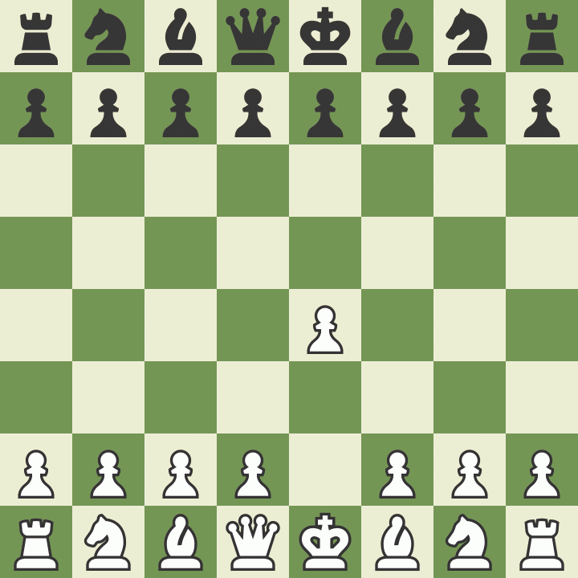
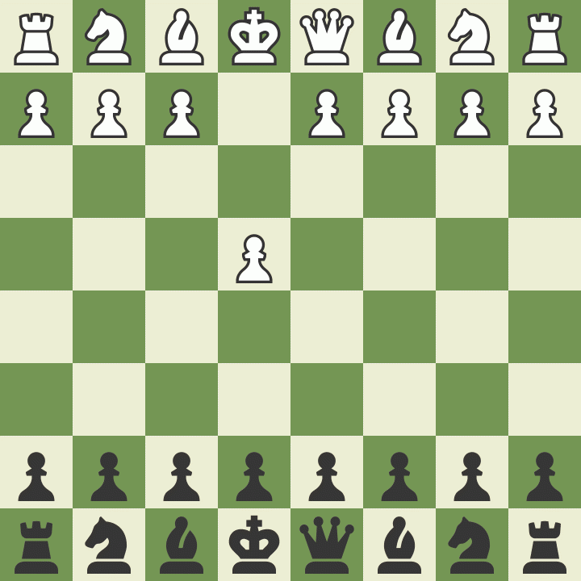
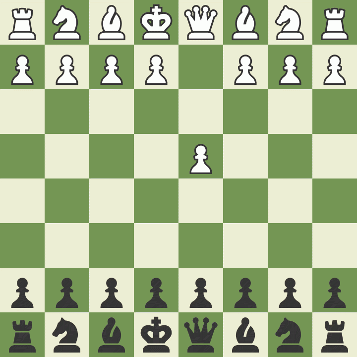

# Mate traps 
> Bemærk US notation N=S (springer).

## Legal Trap
> Hvid

Følger standardudvikling, hvor hvid sætter sin dronning i slag!

    1. e4 e5 2. Nf3 Nc6 3. Bc4 d6 4. Nc3 Bg4 5. h3 Bh5 6. Nxe5 Bxd1 7. Bxf7+ Ke7 8. Nd5# 1-0

## Blackburn Shilling Gambit Trap
> Sort

### Blackburn variant 1
    1. e4 e5 2. Nf3 Nc6 3. Bc4 Nd4 4. Nxe5 Qg5 5. Nxf7 Qxg2 6. Rf1 Qxe4+ 7. Be2 Nf3# 0-1

Hvis hvid i stedet rykker **5. Lxc2!** rykkes kongen væk og truslen med **Dxg2** eksisterer stadig.

### Blackburn variant 2
Hvid hvid i stedet spiller **6. Nxh8**
    1. e4 e5 2. Nf3 Nc6 3. Bc4 Nd4 4. Nxe5 Qg5 5. Nxf7 Qxg2 6. Nxh8 Qxh1+ 7. Bf1 Qxe4+ 8. Be2 Bc5 9. Nc3 Nf3+ 10. Kf1 Qh4 11. Kg2 Qxf2+ 12. Kh1 Qxh2# 0-1

## Elephant Trap
> Sort

Endnu en fælde, hvor vi tilbyder dronningen, men vinder den igen kort efter. Sort står efterfølgende bedst og har byttet en bønder for en springer.

    1. d4 d5 2. c4 e6 3. Nc3 Nf6 4. Bg5 Nbd7 5. cxd5 exd5 6. Nxd5 Nxd5 7. Bxd8 Bb4+ 8. Qd2 Bxd2+ 9. Kxd2 Kxd8

## Lasker Trap
> Sort

Queen's Gambit med Albin's Counter Gambit. Afhænger en del af, hvad hvid gør.
    1. d4 d5 2. c4 e5 3. dxe5 d4 4. e3 Bb4+ 5. Bd2 dxe3 6. Bxb4 exf2+ 7. Ke2 fxg1=N+ 8. Ke1 Qh4+ 9. Kd2 Nc6

## Englund Trap
> Sort

    1. d4 e5 2. dxe5 Nc6 3. Nf3 Qe7 4. Bf4 Qb4+ 5. Bd2 Qxb2 6. Bc3 Bb4

## Fishing Pole Trap
> Sort

Efter **1. e4 e5** og **Nc3** og hvid rokade spilles **Nb4**. Hvis hvid går ud med **a3** trækker sort **a5** og lokker med at hvid kan tage springeren og sort slår **axb**. Hvid kan redde sin springer med **Nd1**. Men her klapper fælden.

    1. e4 e5 2. Nf3 Nc6 3. Bb5 Nf6 4. O-O Ng4 5. h3 h5 6. hxg4 hxg4 7. Ne1 Qh4
