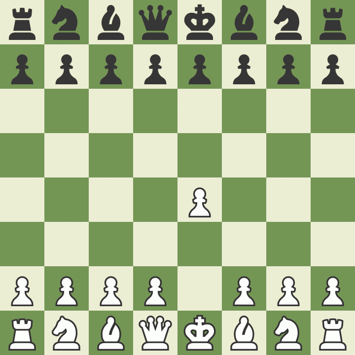

# Mat-fælder fra åbning
> Bemærk US notation N=S (springer).

**Oversigt**

| Side | Åbning | Navn /Link
| -- | -- | -- 
| Hvid | 1. e4 e5 2. Nf3 Nc6 3. Bc4 d6 | [Legal Trap](https://www.chess.com/a/DMn93v4ed8RC)
| Sort | 1. e4 e5 2. Nf3 Nc6 3. Bc4 Nd4 | [Blackburn Shilling Gambit v1](https://www.chess.com/analysis/game/pgn/4uCfYcQFAE)
| Sort | 1. e4 e5 2. Nf3 Nc6 3. Bc4 Nd4 | [Blackburn Shilling Gambit v2](https://www.chess.com/analysis/game/pgn/3mLQoqitCe)
| Sort | 1. d4 d5 2. c4 e6 3. Nc3 Nf6 | [Elephant Trap](https://www.chess.com/analysis/game/pgn/G6BZk3WPg)
| Sort | 1. d4 d5 2. c4 e5 3. dxe5 d4| [Lasker Trap](https://www.chess.com/analysis/game/pgn/4GvgkG7W62)
| Sort | 1. d4 e5 2. dxe5 Nc6 3. Nf3 Qe7 | [Englund Trap](https://www.chess.com/analysis/game/pgn/2tEGjnmccn)
| Sort | 1. e4 e5 2. Nf3 Nc6 3. Bb5 Nf6 | [Fishing Pole Trap](https://www.chess.com/analysis/game/pgn/rLhwRxvsQ)
| Hvid | 1. e4 d6 2. d4 Nf6 3. Nc3 g6 4. Bf4 Bg7 | [Pirc Trap](https://www.chess.com/analysis/game/pgn/2ZVbWc4W9C)

## Legal Trap
> Hvid [link til chess.com](https://www.chess.com/a/DMn93v4ed8RC)

Følger standardudvikling, hvor Hvid sætter sin dronning i slag!

    1. e4 e5 2. Nf3 Nc6 3. Bc4 d6 4. Nc3 Bg4 5. h3 Bh5 6. Nxe5 Bxd1 7. Bxf7+ Ke7 8. Nd5# 1-0

## Blackburn Shilling Gambit Trap
> Sort

### Blackburn variant 1

[link til chess.com](https://www.chess.com/analysis/game/pgn/4uCfYcQFAE)

    1. e4 e5 2. Nf3 Nc6 3. Bc4 Nd4 4. Nxe5 Qg5 5. Nxf7 Qxg2 6. Rf1 Qxe4+ 7. Be2 Nf3# 0-1

Hvis Hvid i stedet rykker **5. Lxc2!** rykkes kongen væk og truslen med **Dxg2** eksisterer stadig.

### Blackburn variant 2
Hvid Hvid i stedet spiller **6. Nxh8**.

[link til chess.com](https://www.chess.com/analysis/game/pgn/3mLQoqitCe)

    1. e4 e5 2. Nf3 Nc6 3. Bc4 Nd4 4. Nxe5 Qg5 5. Nxf7 Qxg2 6. Nxh8 Qxh1+ 7. Bf1 Qxe4+ 8. Be2 Bc5 9. Nc3 Nf3+ 10. Kf1 Qh4 11. Kg2 Qxf2+ 12. Kh1 Qxh2# 0-1

## Elephant Trap
> Sort [link til chess.com](https://www.chess.com/analysis/game/pgn/G6BZk3WPg)

Endnu en fælde, hvor vi tilbyder dronningen, men vinder den igen kort efter. Sort står efterfølgende bedst og har byttet en bønder for en springer.

    1. d4 d5 2. c4 e6 3. Nc3 Nf6 4. Bg5 Nbd7 5. cxd5 exd5 6. Nxd5 Nxd5 7. Bxd8 Bb4+ 8. Qd2 Bxd2+ 9. Kxd2 Kxd8

## Lasker Trap
> Sort [link til chess.com](https://www.chess.com/analysis/game/pgn/4GvgkG7W62)

Queen's Gambit med Albin's Counter Gambit. Afhænger en del af, hvad Hvid gør.
    1. d4 d5 2. c4 e5 3. dxe5 d4 4. e3 Bb4+ 5. Bd2 dxe3 6. Bxb4 exf2+ 7. Ke2 fxg1=N+ 8. Ke1 Qh4+ 9. Kd2 Nc6

## Englund Trap
> Sort [link til chess.com](https://www.chess.com/analysis/game/pgn/2tEGjnmccn)

    1. d4 e5 2. dxe5 Nc6 3. Nf3 Qe7 4. Bf4 Qb4+ 5. Bd2 Qxb2 6. Bc3 Bb4

## Fishing Pole Trap
> Sort [link til chess.com](https://www.chess.com/analysis/game/pgn/rLhwRxvsQ)

    Russisk med Hvids lyse løber til b5.

Efter **1. e4 e5** og **Nc3** og Hvid rokade spilles **Nb4**. Hvis Hvid går ud med **a3** trækker Sort **a5** og lokker med at Hvid kan tage springeren og Sort slår **axb**. Hvid kan redde sin springer med **Nd1**. Men her klapper fælden.

    1. e4 e5 2. Nf3 Nc6 3. Bb5 Nf6 4. O-O Ng4 5. h3 h5 6. hxg4 hxg4 7. Ne1 Qh4

## Pirc Trap
> Hvid [link til chess.com](https://www.chess.com/analysis/game/pgn/2ZVbWc4W9C)

    1. e4 d6 2. d4 Nf6 3. Nc3 g6 4. Bf4 Bg7 5. e5 dxe5 6. dxe5 Qxd1+ 7. Rxd1 Nfd7 8.Nd5 O-O 9. Nxc7 Nb6 10. Be3 Nc6 11. Bxb6 Rb8 12. Bc5 *

