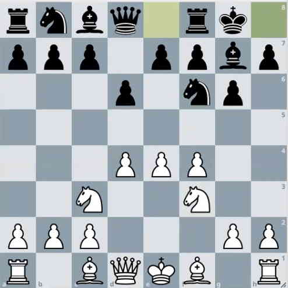
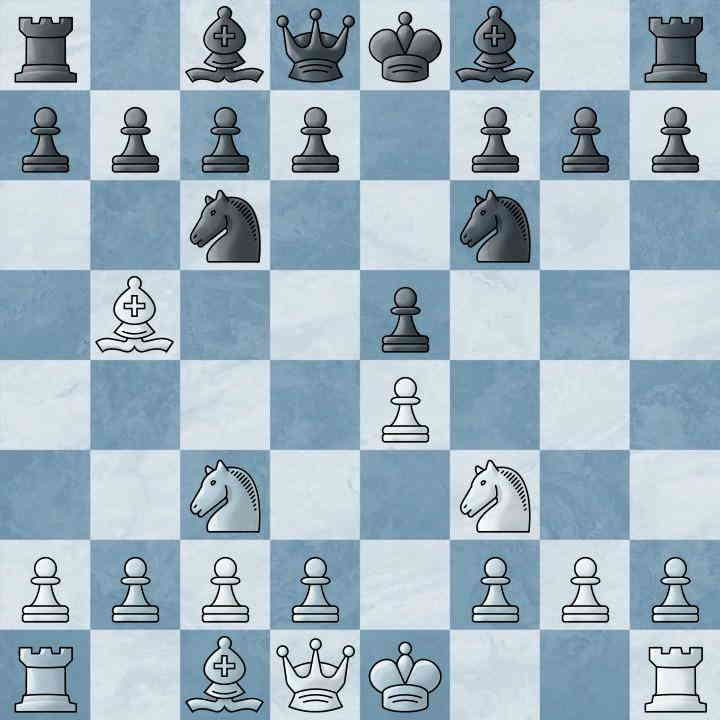
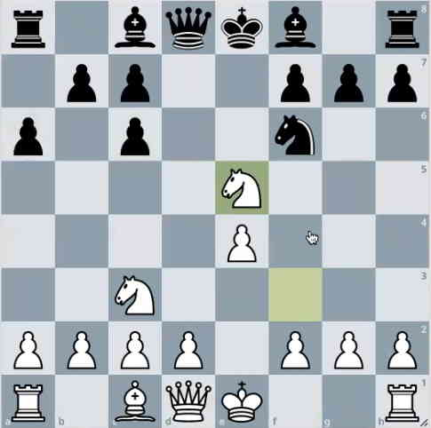
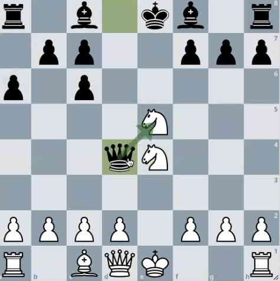
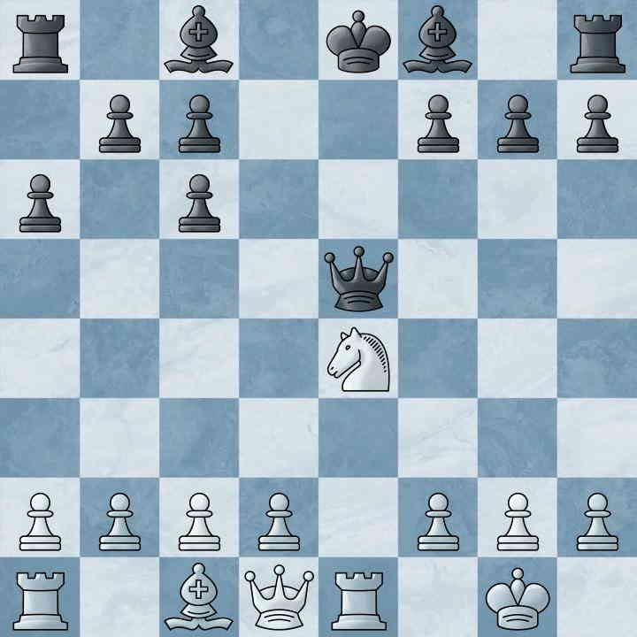

# Åbningsprincippper

## Hvid

### e4 e5 - fokus på midten med bønder
- Hvis sort ikke direkte udfordrer midten med f.eks. **c5**, **e5** eller **Sf6**, så spil **d4** og tag så meget af midten som muligt.
- Hvis **Sciliansk (c3)**, er der en **d4**-gambit, som man følger op med **c3** og ofrer bonden for til gengæld at få udviklet springeren til **c3**. På højere niveau kan bonde-ofret dog blive for dyrt. Forsæt f.eks. med **Sc3**, **f4** og **Sf3**.

### e4 e5 - 4-springer
#### Hvad er formålet med **Lb5**?

Der er noget mere konkret end blot at "binde" springeren. Der er mange der spiller **a6** for at true løberen. Hvis vi slår springeren på **c6**, tager sort som regel med **dxc** for at åbne op. I så fald er **e5** udækket.

*En springer og en bonde er bedre end blot en løber.*

Der er  nogle "tricks" at være opmærksom på. Slår sort bonden på **e4** ned springeren på **f6**, kan vi tage den **Sc3xe4**. Så kan sort rykke **Dd4** og vinde springeren tilbage, men vi står bedre med **O-O** efterfulgt af **Te1**.

